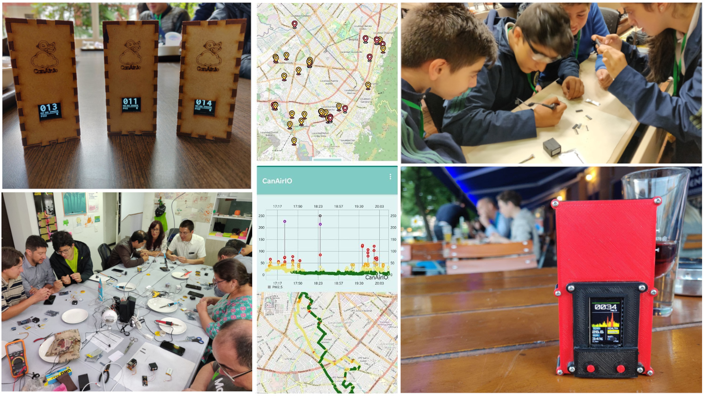

## Overview

CanAirIO is a citizen science project using mobile and fixed air quality stations to measure some variables like PM2.5, CO2, AQI and others air indicators with cell phones and low-cost technology. 

## Building a device

We have some device version alternatives with some guides:

| Device version    | Difficulty |  Status | Links  |
| :------------- |:--------:| :-----------: | :-----------: |
|  CanAirIO without soldering (EN)  | Easy | Outdated |  [Complete guide and video][10] |
|  CanAirIO without soldering (ES)  | Easy | Outdated | [Complete guide and video][11] |
|  CanAirIO device v2.1 (EN)  | Medium | Outdated | [Complete guide and video][12] |
|  CanAirIO device v2.1 (ES)  | Medium | Outdated | [Complete guide and video][13] |
|  CanAirIO TTGO-TDisplay   | Advanced | Deprecated | [Complete guide][14] |
|  CanAirIO Bike   | Advanced | New | [Complete guide][15] |

[10]: https://www.hackster.io/canairio/build-low-cost-air-quality-sensor-canairio-without-soldering-d87494
[11]: https://www.hackster.io/canairio/construye-un-sensor-calidad-del-aire-canairio-sin-soldaduras-8a3c6d
[12]: https://www.hackster.io/canairio-guide-team/canairio-citizen-network-for-air-quality-monitoring-bbf647
[13]: https://www.hackster.io/114723/canairio-red-ciudadana-para-monitoreo-de-calidad-del-aire-96f79a
[14]: https://github.com/hpsaturn/CanAirIO#readme
[15]: https://canair.io/docs/canairio_bike.html



