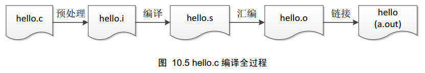

GCC常用命令　　

GCC编译过程

从hello.c到hello(或a.out)文件，必须历经hello.i、hello.s、hello.o，最后才得到hello(或a.out)文件，分别对应这预处理、编译、汇编和
链接４个步骤，整个过程如下：

这４步大致的工作内容如下：
* 预处理  C编译器对各种预处理命令进行处理，包括头文件包含、宏定义扩展和条件编译的选择等,生成后缀为.i的预编译文件。
* 编译    预处理后的.i文件编译成为汇编语言，生成.s文件。
* 汇编    将汇编语言文件经过汇编，生成目标文件.o文件。
* 链接    将各个模块的.o文件链接起来，生成后缀为.out的文件。 

1. 预处理 -E 
   
   gcc -E -o hello.i hello.c

   预处理就是将要包含的文件插入原文件中、将宏定义展开、根据条件编译命令选择要使用的代码，将这些代码输出到一个.i文件中等待进一步处理。

2. 编译 -S 
   
   gcc -S -o hello.s hello.i  

　　编译就是把c/c++代码（.i文件）翻译成汇编代码

3. 汇编 -c  
   
   gcc -c -o hello.o hello.s 
 
   汇编就是将第二步输出的汇编代码翻译成符合一定格式的机器代码，在linux上就是ELF文件(obj文件)

4. 链接 　　
    
　　－o 指定输出文件名

   gcc -o hello hello.o

   链接就是将汇编生成的obj文件、系统库的obj文件、库文件链接起来，最终生成可执行文件。

5. 生成符号 -g
　　
   gcc -g -o hello hello.c 

6. -O　　
   
   对程序进行优化编译、链接 

7. -O2  
    
   比-O更好的优化编译、链接，当然整个编译链接过程会更慢。

8. -I  
    
  增加头文件搜索目录  

  gcc -I /opt/include hello.c

* -I指定的目录  
* gcc环境变量C_INCLUDE_PATH,CPLUS_INCLUDE_PATH  
* 系统默认目录  
  /usr/include  
  /usr/local/include  
  /usr/lib/gcc-lib/i386-linux/2.95.2/include
  /usr/lib/gcc-lib/i386-linux/2.95.2/../../../../include/g++-3
  /usr/lib/gcc-lib/i386-linux/2.95.2/../../../../i386-linux/include

9. -L DIRECTORY 
    
  增加库文件搜索目录  

  gcc -L /opt/lib hello.c

编译时库文件搜索顺序：  
* -L指定的目录  
* gcc环境变量LIBRARY_PATH  
* 系统默认目录  
  /lib  
  /usr/lib  
  /usr/local/lib  

运行时库文件搜索顺序：
* 编译目标代码时指定的动态库搜索路径
* 环境变量LD_LIBRARY_PATH指定的动态库搜索路径
* 配置文件/etc/ld.so.conf中指定的动态库搜索路径
* 系统默认动态库搜索路径/lib和/usr/lib

10. -l LIBNAME 　　
    
   链接LIBNAME库

   gcc -l test hello.c

11. -shared 　　
    
   生成动态库

   gcc -shared hello.c

11. 其他命令  
    
   * 0或home 移动到当前行行首  
   * $或end  移动到当前行行尾  
   * G       移动到当前文档最后一行  
   * nG      移动到当前文档的第n行  
   * gg      移动到当前文档的第一行，相当于1G  
   * n<Enter>光标向下移动n行   
      