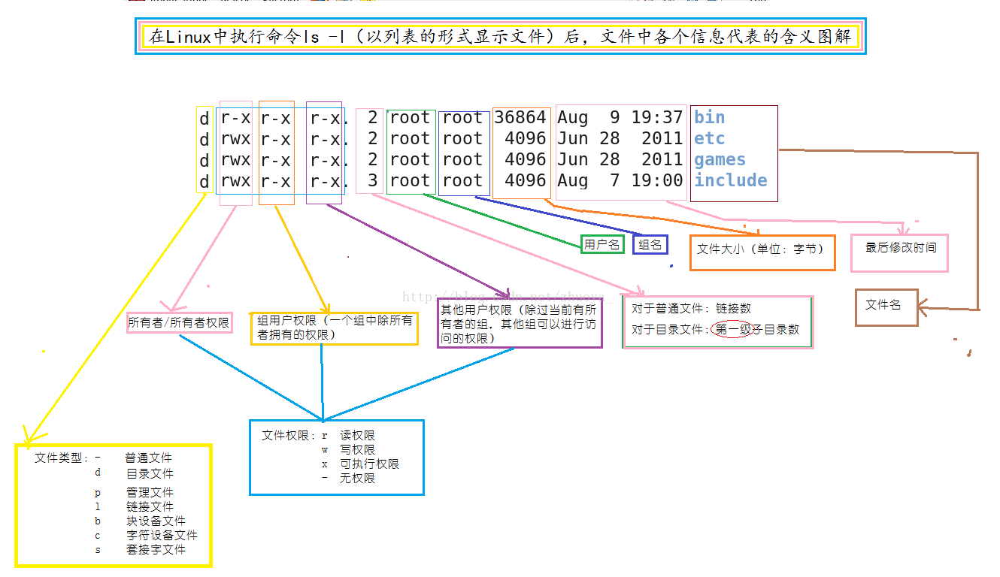

Linux环境变量分为全局环境变量和局部环境变量；全局变量不仅对shell会话可见，对所有shell创建的子进程也可见；局部环境变量仅对创建它们的shell可见。

1.查看文件权限　　
  
$ ls -l　　
total 2356　　　　　
-rw-r--r-- 1 simple simple  45945 11月 26 09:21 aclocal.m4　　
-rwxr-xr-- 1 simple simple   5827 11月 26 09:21 ar-lib　　
-rwxr-xr-- 1 simple simple   1007 11月 26 07:15 autogen.sh　　
drwxr-xr-x 7 simple simple   4096 3月   7 11:22 benchmarks  
     

　　输出结果的第一个字段是描述文件和目录权限的码。这个字段的第一个字符代表了对象的类型：　　
   * -代表文件
   * d代表目录
   * l代表链接
   * c代表字符类型
   * b代表块设备
   * n代表网络设备    

　　之后有３组三字符的码，每一组三字码表示三重访问权限:  
   * r代表对象是可读的
   * w代表是可写的
   * x代表是可执行的

  　如果没有某种权限，在该权限位会出现单破折线。这３组三字码分别对应对象的３个安全级别:
   * 对象的属主
   * 对象的属组
   * 系统其他用户 

　　以aclocal.m4为例：
   * rw-表示文件的属主simple有读、写权限，没有执行权限
   * r--表示文件的属组simple只有读权限
   * r--表示其他用户只有读权限 

2.Linux文件权限码  

    |  权限     | 二进制值  | 八进制值  |  描述   |    
    |:--------:|:--------:|:--------:|:--------:| 
    | ---      | 000      |    0      | 没有任何权限  | 
    | --x      | 001      |    1      | 只有执行权限  | 
    | -w-      | 010      |    2      | 只有写入权限  | 
    | -wx      | 011      |    3      | 有写和执行权限  | 
    | r--      | 100      |    4      | 只有写入权限  | 
    | r-x      | 101      |    5      | 有写入和执行权限  | 
    | rw-      | 110      |    6      | 有读和写权限  | 
    | rwx      | 111      |    7      | 有读、写和执行权限  | 

3.修改文件权限

  chmod options mode file　　
  chmod [ugoa...][+-=][rwxXstugo...]

  第一组字符定义了权限作用的对象:  
  * u代表用户
  * g代表组
  * o代表其他
  * a代表上述所有  
  
  后面跟着的符号表示你是想在现有权限基础上增加权限、移除权限还是设置权限
  * +在现有权限的基础上增加权限
  * -在现有权限的基础上移除权限
  * =设置成后面的权限
  
  最后，第３个符号代表作用到设置上的权限。
  * X 如果对象是目录或者它已有执行权限，赋予执行权限
  * s 运行时重新设置UID或GID
  * t 保留文件或目录
  * u 将权限设置为跟属主一样
  * g 将权限设置为跟属组一样
  * o 将权限设置为跟其他用户一样
  

